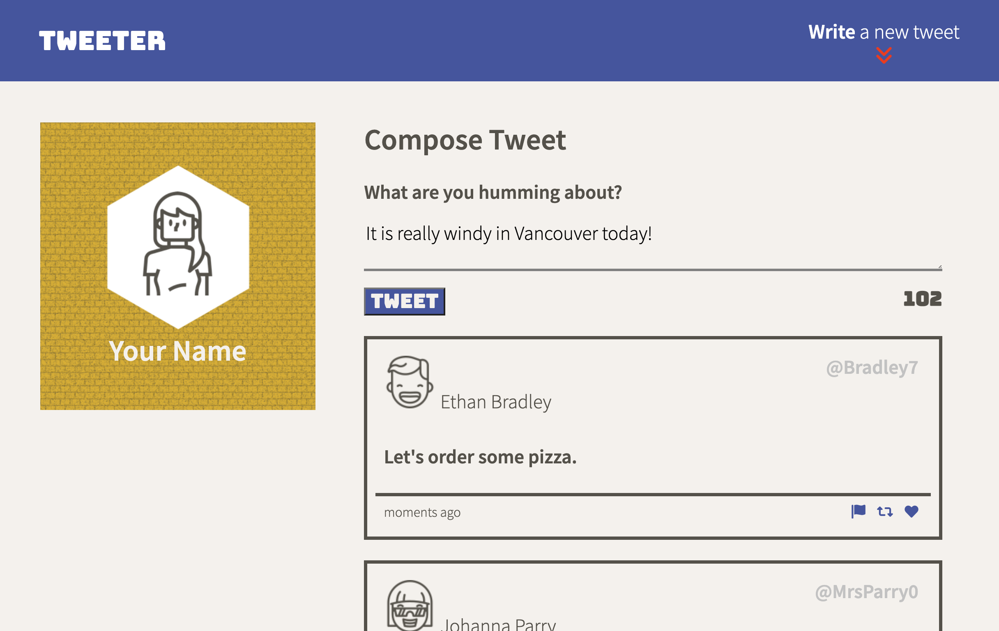
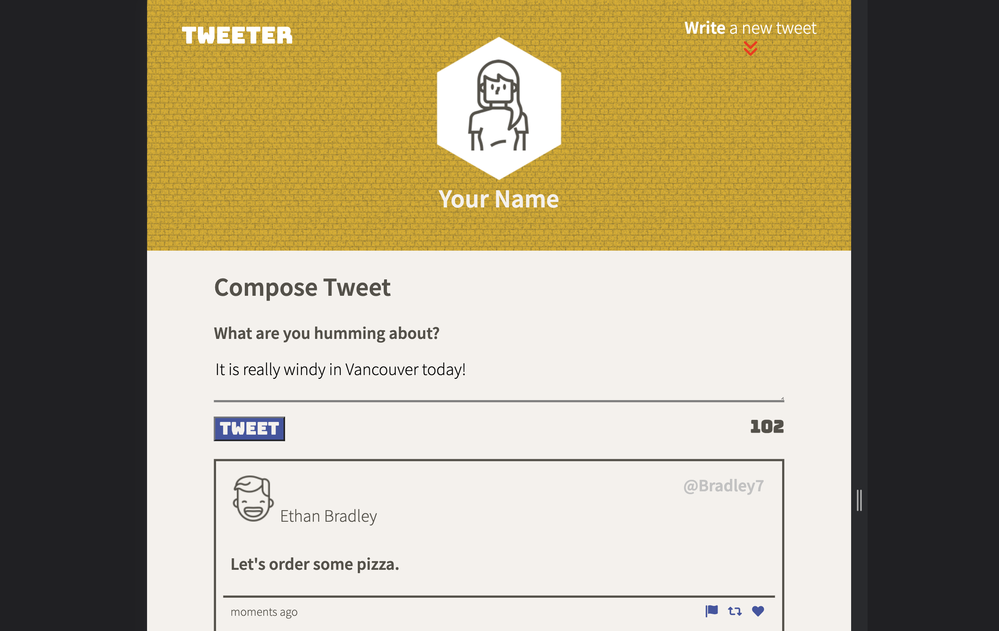
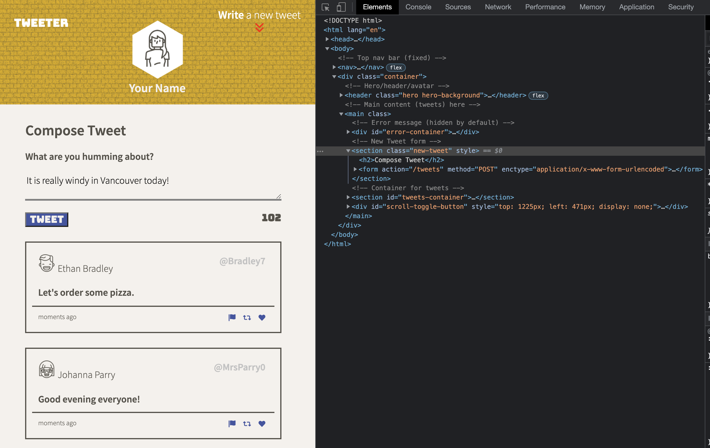

# Tweeter Project

## About
Tweeter is a simple, single-page Twitter clone.

This project is essentially a front-end development exercise and not meant to be used anywhere in production.

## Responsive Design
Two breakpoints (three formats) have been implemented:
* Mobile (up to 767 pixels wide)
  * single column, no fixed navigation
  * smaller fonts and images
  * even thinner lines
* Tablet (up to 1023 pixels wide)
  * single column, no fixed navigation
  * thinner lines  
* Desktop (at least 1024 pixels wide) 
  * two columns, fixed navigation

## Javascript functionality
* Click the compose button to write a tweet
* While typing, the remaining character count will be displayed to the user with its color changing when it turns negative
* Upon submission, the new tweet will be checked for adequate length (non-empty, not longer than 140 characters) and an appropriate error message will display if the validation fails
* Upon successful submission, the tweet list will reload
* Two ideas for improvement:
  * instead of reloading the whole list, only the tweets that have been submitted since the last reload should be added
  * for performance and scalability reasons, there should be a limit to how many tweets are loaded by default (with more to be loaded when the user has scrolled to the bottom of the page)

## CSS animations
* The new tweet form will slide in and out of view
* Error messages will slide in and out of view
* On scrolling, the main compose button will fade out and second compose button will fade in (javascript aided)
* The double arrows in both compose buttons will wiggle when hovered over

## Screen Shots
#### Desktop format:

#### Tablet format:

#### Mobile format:

(Note: for some reason the mobile breakpoint did not trigger in Chrome dev-tools, hence the inconsistent look of the screenshot)

## Install and Run Tweeter:

Type the following commands:
* ```git clone http://github.com/jowe81/tweeter```
* ```npm install```
* ```npm run local```

Upon success, visit [http://localhost:8080](http://localhost:8080) in your browser.

## Dependencies

- [NodeJS](https://nodejs.org): 15.x or above
- [body-parser](https://www.npmjs.com/package/body-parser): 1.15.2 or above
- [chance](https://www.npmjs.com/package/chance): 1.0.2 or above
- [express](https://www.npmjs.com/package/express): 4.13.4 or above
- [md5](https://www.npmjs.com/package/md5): 2.1.0 or above